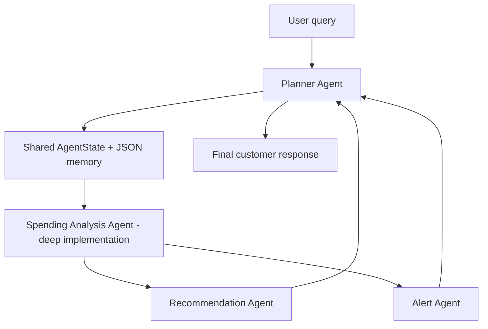

# Personal Finance Advisor Agent

A lightweight multi-agent simulation for helping customers understand and improve their financial health. It uses mock transaction data, a command-line interface, basic memory, tool/function calling, and planner-led orchestration.

The demo runs with standard Python. `requirements.txt` lists optional LangChain/LangGraph/CrewAI dependencies for extending the same architecture into framework-native agents.

## Run

```powershell
python main.py
python main.py "show unusual spending and alerts" --month 2026-04 --trace
python main.py "how can I improve savings?" --month 2026-05
python main.py --chat --month 2026-05
```

On Windows, you can use the short demo launchers instead:

```powershell
.\run_demo.ps1
.\run_chat.ps1
```

If PowerShell script execution is blocked, use the batch launchers:

```powershell
.\run_demo.bat
.\run_chat.bat
```

## Agent Architecture



### 1. Planner Agent

Location: `finance_advisor/agents/planner.py`

Responsibilities:

- Understands user intent with lightweight routing logic.
- Decides which agents should be invoked.
- Maintains execution order.
- Combines agent outputs into the final answer.

Example routes:

- Advice query: `spending_analysis_agent -> recommendation_agent`
- Alert query: `spending_analysis_agent -> alert_agent`
- Full health query: `spending_analysis_agent -> recommendation_agent -> alert_agent`

### 2. Spending Analysis Agent

Location: `finance_advisor/agents/spending_analysis.py`

This is the agent implemented in depth. It simulates a reasoning agent with explicit tool calls:

- `load_transactions`: reads mock customer transactions.
- `filter_month`: selects the requested or latest month.
- `monthly_totals`: calculates income, spend, net cash flow, and savings rate.
- `category_spend`: groups spending into expense categories.
- `compare_to_baseline`: compares current category spend to prior months.
- `find_unusual_transactions`: flags large or category-relative unusual transactions.

Reasoning flow:

1. Load only the active customer's transactions.
2. Pick the target month from the query or latest available transaction.
3. Calculate overall financial position: income, spend, net cash flow, savings rate.
4. Rank categories and merchants to explain where money went.
5. Compare category behavior against historical baseline.
6. Identify unusual transactions for downstream alerts.
7. Return structured insights for other agents.

### 3. Recommendation Agent

Location: `finance_advisor/agents/recommendation.py`

Uses spending insights and customer memory preferences to produce practical advice. It is intentionally simplified and rule-based.

Examples:

- Dining over budget -> suggest replacing delivery with planned groceries.
- Shopping spike -> suggest a 48-hour rule for non-essential purchases.
- Savings goal gap -> calculate the amount of flexible spend to reduce.

### 4. Alert Agent

Location: `finance_advisor/agents/alert.py`

Generates proactive financial alerts from spending analysis output:

- Threshold breaches.
- Overspending behavior.
- Unusual high-value transactions.
- Category trend increases versus baseline.

## Orchestration Logic

Location: `finance_advisor/orchestrator.py`

The orchestrator behaves like a small LangGraph-style execution graph:

1. Create shared `AgentState`.
2. Load customer memory from `.advisor_memory.json`.
3. Ask planner for a route.
4. Execute agents in route order.
5. Store spending insights and recent run summary in memory.
6. Ask planner to synthesize a single customer-facing answer.

`AgentState` is the coordination object passed between agents. This mirrors how LangGraph state would move through graph nodes.

## Memory Handling

Location: `finance_advisor/memory.py`

The demo uses JSON-backed customer memory:

- `preferences`: budgets and savings goal.
- `recent_runs`: last few interactions.
- `last_insights`: latest spending analysis output.

This is intentionally simple, inspectable, and safe for a local demonstration.

## Mock Data

Location: `data/mock_transactions.csv`

The dataset includes three months of transactions for `CUST001`, including income, rent, groceries, dining, transport, shopping, utilities, subscriptions, travel, and healthcare.

## Framework Fit

This implementation is framework-ready:

- Planner route = graph router.
- Each agent class = graph node or CrewAI agent task.
- `AgentState` = LangGraph state schema.
- Tool functions in `finance_advisor/tools.py` = LangChain tools.
- CLI = lightweight user interface for demo interaction.

The current version avoids mandatory external dependencies so evaluators can run it immediately.

## Conversational CLI

Use `--chat` for a simple customer conversation loop. Each customer query goes back through the planner, uses the same JSON memory, and can route to different agents depending on intent.
