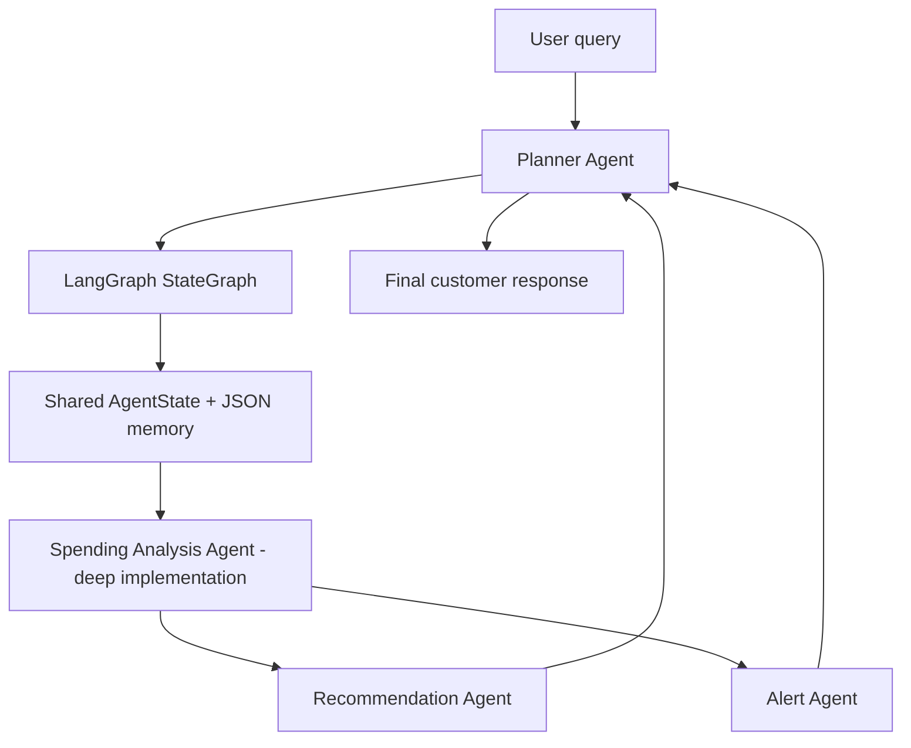

# Personal Finance Advisor Agent

A lightweight multi-agent system for helping customers understand and improve their financial health. It uses mock transaction data, a command-line interface, basic memory, tool/function calling, LangGraph orchestration, LangChain LLM integration, and Groq API for natural-language planning/recommendation/final response generation.

Financial calculations remain deterministic Python tools so totals, category spend, baselines, and alerts are explainable.

## Frameworks Used

- **LangGraph**: graph/state-machine orchestration across planner, spending, recommendation, alert, and synthesis nodes.
- **LangChain**: LLM wrapper through `langchain-groq`.
- **Groq API**: configured as the LLM provider using `GROQ_API_KEY`.
- **Python tools**: deterministic transaction analysis functions.

CrewAI is not required because LangGraph is the chosen orchestration framework for this implementation.

## Setup

Install dependencies:

```powershell
pip install -r requirements.txt
```

Set your Groq API key:

```powershell
$env:GROQ_API_KEY="your_groq_api_key"
```

Optional model override:

```powershell
$env:GROQ_MODEL="llama-3.3-70b-versatile"
```

If `GROQ_API_KEY` or framework dependencies are missing, the project still runs with a local fallback so the demo does not break. With dependencies and key present, trace output shows:

```text
Runtime: LangGraph
LLM provider: groq_via_langchain
```

Check Groq readiness:

```powershell
python check_groq.py
```

## Run

```powershell
python main.py
python main.py "show unusual spending and alerts" --month 2026-04 --trace
python main.py "how can I improve savings?" --month 2026-05
python main.py --chat --month 2026-05
```

On Windows, you can use the short demo launchers instead:

```powershell
.\run_demo.ps1
.\run_chat.ps1
```

If PowerShell script execution is blocked, use the batch launchers:

```powershell
.\run_demo.bat
.\run_chat.bat
```

## Agent Architecture



### 1. Planner Agent

Location: `finance_advisor/agents/planner.py`

Responsibilities:

- Understands user intent using Groq API when configured, with keyword fallback for offline demos.
- Decides which agents should be invoked.
- Maintains execution order.
- Combines agent outputs into the final answer.

Example routes:

- Advice query: `spending_analysis_agent -> recommendation_agent`
- Alert query: `spending_analysis_agent -> alert_agent`
- Full health query: `spending_analysis_agent -> recommendation_agent -> alert_agent`

### 2. Spending Analysis Agent

Location: `finance_advisor/agents/spending_analysis.py`

This is the agent implemented in depth. It simulates a reasoning agent with explicit tool calls:

- `load_transactions`: reads mock customer transactions.
- `filter_month`: selects the requested or latest month.
- `monthly_totals`: calculates income, spend, net cash flow, and savings rate.
- `category_spend`: groups spending into expense categories.
- `compare_to_baseline`: compares current category spend to prior months.
- `find_unusual_transactions`: flags large or category-relative unusual transactions.

Reasoning flow:

1. Load only the active customer's transactions.
2. Pick the target month from the query or latest available transaction.
3. Calculate overall financial position: income, spend, net cash flow, savings rate.
4. Rank categories and merchants to explain where money went.
5. Compare category behavior against historical baseline.
6. Identify unusual transactions for downstream alerts.
7. Return structured insights for other agents.

### 3. Recommendation Agent

Location: `finance_advisor/agents/recommendation.py`

Uses spending insights and customer memory preferences to produce practical advice. It is intentionally simplified and rule-based.

Examples:

- Dining over budget -> suggest replacing delivery with planned groceries.
- Shopping spike -> suggest a 48-hour rule for non-essential purchases.
- Savings goal gap -> calculate the amount of flexible spend to reduce.

### 4. Alert Agent

Location: `finance_advisor/agents/alert.py`

Generates proactive financial alerts from spending analysis output:

- Threshold breaches.
- Overspending behavior.
- Unusual high-value transactions.
- Category trend increases versus baseline.

## Orchestration Logic

Location: `finance_advisor/orchestrator.py`

The orchestrator builds a real LangGraph `StateGraph` when `langgraph` is installed:

1. Create shared `AgentState`.
2. Load customer memory from `.advisor_memory.json`.
3. Ask planner for a route.
4. Move through LangGraph nodes in route order.
5. Store spending insights and recent run summary in memory.
6. Ask the Groq-backed planner synthesis to produce a single customer-facing answer.

`AgentState` is the coordination object passed between graph nodes.

## Memory Handling

Location: `finance_advisor/memory.py`

The demo uses JSON-backed customer memory:

- `preferences`: budgets and savings goal.
- `recent_runs`: last few interactions.
- `last_insights`: latest spending analysis output.

This is intentionally simple, inspectable, and safe for a local demonstration.

## Mock Data

Location: `data/mock_transactions.csv`

The dataset includes three months of transactions for `CUST001`, including income, rent, groceries, dining, transport, shopping, utilities, subscriptions, travel, and healthcare.

## Framework Fit

This implementation is framework-backed:

- Planner route = LangGraph conditional routing.
- Each agent class = graph node.
- `AgentState` = shared graph state.
- Tool functions in `finance_advisor/tools.py` = deterministic financial tools that can be wrapped as LangChain tools.
- CLI = lightweight user interface for demo interaction.

The current version also includes fallback behavior so evaluators can run it even before configuring an API key.

## Conversational CLI

Use `--chat` for a simple customer conversation loop. Each customer query goes back through the planner, uses the same JSON memory, and can route to different agents depending on intent.
